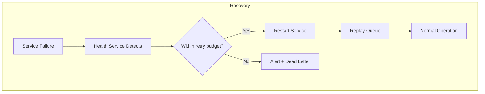

# Architecture Overview

## Purpose

Define the complete system architecture of Objective, including all components, their relationships, data flow, event flow, processing pipelines, and failure recovery mechanisms. This is the authoritative reference for how the system is structured.

## Scope

This document covers the high-level architecture, component interactions, data flow through the system, internal service mesh, event-driven communication, processing pipeline design, and failure modes. Detailed specifications for individual services are in `service-boundaries.md`. Design decisions are documented in `architecture-decisions.md`.

## Responsibilities

- Provide a complete mental model of the system
- Define component boundaries and interaction patterns
- Document data flow from ingestion to broadcast
- Specify event schemas and message passing
- Define processing pipeline semantics
- Document failure recovery and self-healing

## Assumptions

- Deployment is single-machine for MVP; multi-machine distributed deployment is Phase 3
- All components communicate via an internal message bus
- Each component can restart independently without data loss
- Storage (Kuzu, vector DB, blob storage) is on local filesystem
- System runs on macOS, Linux, and Windows

## Design

### High-Level Architecture

```
┌─────────────────────────────────────────────────────────────────────┐
│                         OBJECTIVE SYSTEM                            │
│                                                                     │
│  ┌──────────┐  ┌──────────┐  ┌──────────┐  ┌──────────────────┐   │
│  │ INGESTION │  │ EXTRACTION│  │ CORRELA- │  │   BROADCAST      │   │
│  │  LAYER    │─▶│  LAYER   │─▶│  TION    │─▶│     LAYER        │   │
│  │           │  │          │  │  LAYER   │  │                  │   │
│  │ Sources   │  │ Entities │  │Events    │  │ Reports          │   │
│  │ Adapters  │  │ Claims   │  │Narratives│  │ Audio            │   │
│  │ Registry  │  │ Relations│  │Contradic.│  │ Streaming        │   │
│  └─────┬─────┘  └─────┬────┘  └─────┬────┘  └────────┬─────────┘   │
│        │               │             │                │             │
│        └───────────────┴─────────────┴────────────────┘             │
│                                │                                    │
│                        ┌───────┴────────┐                          │
│                        │  KNOWLEDGE     │                          │
│                        │    GRAPH       │                          │
│                        │  (Kuzu DB)     │                          │
│                        └────────────────┘                          │
│                                                                     │
│  ┌──────────┐  ┌──────────┐  ┌──────────┐  ┌──────────────────┐   │
│  │  MODEL   │  │  QUEUE   │  │  STORAGE │  │   SCHEDULER      │   │
│  │  RUNTIME │  │  SYSTEM  │  │  MANAGER │  │   (Cron/Periodic)│   │
│  └──────────┘  └──────────┘  └──────────┘  └──────────────────┘   │
│                                                                     │
│  ┌──────────┐  ┌──────────┐  ┌──────────┐  ┌──────────────────┐   │
│  │  PLUGIN  │  │ MONITOR  │  │ RECOVERY │  │   API GATEWAY    │   │
│  │   HOST   │  │ SERVICE  │  │ SERVICE  │  │  (REST + WS)     │   │
│  └──────────┘  └──────────┘  └──────────┘  └──────────────────┘   │
│                                                                     │
└─────────────────────────────────────────────────────────────────────┘
```

### Component Relationships

```
                    ┌──────────────────┐
                    │    Scheduler     │
                    │  (cron/periodic) │
                    └────────┬─────────┘
                              │ triggers
                              ▼
┌──────────────────────────────────────────────────────────────────┐
│                     MESSAGE BUS (NATS/RabbitMQ)                   │
│  Topics: ingestion.*, extraction.*, correlation.*, broadcast.*,  │
│          plugin.*, system.*                                       │
└─────┬─────────┬──────────┬──────────┬──────────┬────────────────┘
      │         │          │          │          │
      ▼         ▼          ▼          ▼          ▼
┌─────────┐ ┌────────┐ ┌────────┐ ┌────────┐ ┌──────────┐
│ Source  │ │Entity  │ │Event   │ │Narrative│ │ Broadcast│
│ Adapter │ │Extract │ │Engine  │ │Engine   │ │ Generator │
└────┬────┘ └────┬───┘ └────┬───┘ └────┬───┘ └────┬─────┘
     │           │          │          │          │
     ▼           │          │          │          │
┌──────────┐     │          │          │          │
│  Source  │     │          │          │          │
│ Registry │     │          │          │          │
└──────────┘     │          │          │          │
                 └──────────┴──────────┴──────────┘
                              │
                              ▼
                  ┌────────────────────┐
                  │   Event Repository │
                  │ (in-memory + file) │
                  └─────────┬──────────┘
                            │
                            ▼
                  ┌────────────────────┐
                  │   Knowledge Graph  │
                  │      (Kuzu)        │
                  └────────────────────┘

Sidecar:
┌────────────────┐    ┌────────────────┐    ┌────────────────┐
│  Plugin Host   │◀──▶│  Health /      │    │  API Gateway   │
│ (built-ins +   │    │  Monitoring /  │    │  (REST + WS)   │
│  discovered)   │    │  Recovery      │    │                │
└────────────────┘    └────────────────┘    └────────────────┘
```

### Data Flow

```
[Source Data]
    │
    ▼
┌───────────────┐     ┌──────────────┐     ┌─────────────────┐
│ Source Adapter│────▶│ Raw Document │────▶│ Document Queue  │
│ (RSS, Reddit, │     │   Store      │     │ (durable, ack)  │
│  YouTube,...) │     │ (JSON, HTML, │     └────────┬────────┘
└───────────────┘     │  Markdown)   │              │
                      └──────────────┘              ▼
                                              ┌───────────────┐
                                              │  Extraction   │
                                              │   Pipeline    │
                                              └───────┬───────┘
                                                      │
                   ┌──────────────────────────────────┼──────────────────────┐
                   │                                  │                      │
                   ▼                                  ▼                      ▼
           ┌──────────────┐                  ┌──────────────────┐  ┌─────────────────┐
           │  Knowledge   │                  │   Vector Store   │  │  Embedding      │
           │  Graph       │                  │  (qdrant/lancedb)│  │  Cache          │
           │  (Kuzu DB)   │                  └──────────────────┘  └─────────────────┘
           └──────┬───────┘
                  │
                  ▼
           ┌──────────────┐
           │  Correlation │
           │  Pipeline    │
           │  (events,    │
           │   narratives,│
           │   contradict)│
           └──────┬───────┘
                  │
                  ▼
           ┌──────────────┐
           │  Broadcast   │
           │  Queue       │
           └──────┬───────┘
                  │
                  ▼
           ┌──────────────┐     ┌──────────────┐
           │ Report Gen   │────▶│ Audio Gen    │
           └──────────────┘     └──────────────┘
                                       │
                                       ▼
                               ┌────────────────┐
                               │  Audio Archive │
                               │  + Stream      │
                               └────────────────┘
```

### Internal Services

| Service | Responsibility | Dependencies |
|---------|---------------|--------------|
| Scheduler | Triggers periodic jobs (ingestion, extraction, broadcast) | None |
| Ingestion Service | Manages source adapters, polls sources, stores raw documents | Scheduler, Message Bus, Source Registry |
| Source Registry | Persists user-managed adapter definitions, materialises adapters on demand | Filesystem |
| Extraction Service | Processes raw documents: entity extraction, claim extraction, relationship extraction, event extraction | Message Bus, Knowledge Graph, Model Runtime |
| Correlation Service | Runs event engine, narrative engine, contradiction detection | Knowledge Graph, Event Repository |
| Event Repository | Persists derived `Event` records (in-memory + JSON file implementations) | Filesystem |
| Broadcast Service | Generates reports, schedules broadcasts, manages audio pipeline | Knowledge Graph, Message Bus |
| Model Runtime | Manages LLM inference, embedding generation | None (wraps llama.cpp, ONNX, etc.) |
| Queue System | Durable message passing between services | Storage (for queue persistence) |
| Storage Manager | Manages knowledge graph backups, snapshots, archiving | Knowledge Graph |
| Monitoring Service | Records per-pipeline counters and uptime, exposed via `/api/v1/monitoring` | Message Bus |
| Recovery Service | Detects stalled / erroring pipelines, publishes crash + recovery + heartbeat events | Monitoring Service, Message Bus |
| Health Service | Exposes `/api/v1/health` aggregate status and per-service status | All services |
| Plugin Host | Manages plugin lifecycle, routes bus events to subscribed plugins, persists plugin state | Message Bus, Filesystem |
| API Gateway | REST + WebSocket, source-registry + plugin CRUD, dashboard asset serving | All services |

### Event Flow

Objective uses an event-driven architecture. All services communicate via a durable message bus.

```
Event Types:

 ingestion.document.received     ── Source adapter received a new document
 ingestion.document.processed    ── Document has been stored
 extraction.document.processed   ── Document has been extracted (entities/claims/relations)
 extraction.entity.extracted     ── Entity extracted from a document
 extraction.claim.extracted      ── Claim extracted from a document
 extraction.relationship.formed  ── Relationship identified between entities
 correlation.event.detected      ── New event formed from claims
 correlation.event.updated       ── Event confidence or scope changed
 correlation.narrative.formed    ── Narrative cluster created
 correlation.narrative.updated   ── Narrative cluster modified
 correlation.contradiction.detected ── Contradiction found
 broadcast.scheduled             ── Broadcast job scheduled
 broadcast.generated             ── Broadcast content produced
 broadcast.audio.ready           ── Audio file generated
 plugin.re_emitted               ── Republished event from a built-in plugin
 system.heartbeat                ── Periodic health check (published by Recovery Service)
 system.service.crash            ── Service failure detected
 system.service.recovered        ── Service restarted
 scheduler.job.triggered         ── Periodic job fired by the Scheduler Service
```

Each event contains:

```json
{
  "id": "uuid-v7",
  "type": "ingestion.document.received",
  "source": "ingestion.rss.cnn",
  "timestamp": "2026-06-02T12:00:00Z",
  "correlation_id": "uuid-v7",
  "data": { /* event-specific payload */ },
  "metadata": {
    "version": 1,
    "retry_count": 0,
    "producer": "service-name"
  }
}
```

### Processing Pipelines

**Ingestion Pipeline:**
```
Source URL → Fetch → Parse → Validate → Store Raw → Emit Event
```

**Extraction Pipeline:**
```
Raw Document → Chunk → [Entity Extraction, Claim Extraction, Relation Extraction]
             → Deduplicate → Merge into Graph → Emit Events
```

**Correlation Pipeline:**
```
Graph Changes → [Event Formation, Narrative Clustering, Contradiction Detection]
             → Update Graph → Emit Events
```

**Broadcast Pipeline:**
```
Graph Query → Topic Selection → Content Ranking → Report Generation
           → Audio Generation → Archive → Notify UI
```

Each pipeline stage:
1. Reads from a durable queue (or event subscription)
2. Processes the work item
3. Writes output to the knowledge graph
4. Emits completion events
5. On failure, retries with exponential backoff (max 3 retries)
6. After max retries, writes to dead-letter queue

### Failure Recovery

| Failure Mode | Detection | Recovery |
|-------------|-----------|----------|
| Service crash | Health check timeout | Automatic restart via process manager |
| Queue consumer stall | Heartbeat missing | Restart consumer, redeliver unacked messages |
| Model inference timeout | Wall-clock timeout | Retry with reduced context, fallback to smaller model |
| Knowledge graph corruption | Checksum mismatch | Restore from latest snapshot |
| Disk full | Storage metrics alert | Automatic archive rotation, compaction |
| Network unavailable (ingestion) | Connection timeout | Skip poll cycle, retry on next schedule |
| Source adapter failure | Repeated errors | Disable adapter, alert via health service |
| Broadcast generation failure | Pipeline timeout | Skip broadcast cycle, retry next interval |
| Pipeline stall | Recovery Service: zero activity + error-rate climb | Publish `system.service.crash`; auto-recover on next healthy check; publish `system.service.recovered` |
| Plugin handler error / timeout | Plugin Host `consecutive_failures` counter | Force-restart on user demand; built-in `audit-log` records all events; persistent state survives restart |
| Source removed at runtime | Source Registry CRUD via API | Pipeline worker skips disabled sources on next tick; enabled toggle preserves configuration for re-enable |

If a service is unhealthy:
1. Health service marks it as degraded
2. Dependent services operate in reduced mode
3. When service recovers, it replays missed events from the durable queue
4. System returns to normal operation automatically



## Interfaces

- `service-boundaries.md` — detailed interfaces for each service
- `internal-api.md` — message schemas and event contracts
- `data/storage-architecture.md` — storage layer interfaces
- `ingestion/ingestion-architecture.md` — ingestion pipeline details

## Failure Modes

| Failure | Impact | Mitigation |
|---------|--------|------------|
| Message bus failure | Complete system halt | Durable queues with crash recovery, bus HA mode |
| Knowledge graph unavailable | All processing stops | Connection pooling, retry, circuit breaker |
| Cascading service failures | System instability | Circuit breakers between services, bulkheads |
| Resource exhaustion (memory/CPU) | Degraded performance | Resource limits per service, backpressure |
| Clock skew affects scheduling | Missed or duplicate jobs | NTP dependency, idempotent job design |
| Corrupt snapshot restores | Data loss | Multiple snapshot generations, verify on restore |

## Future Extensions

- Horizontal scaling: partition services across machines
- Multi-region knowledge graph replication
- Hot-standby for zero-downtime upgrades
- Dynamic resource allocation based on system load
- Predictive scaling for known ingestion patterns
